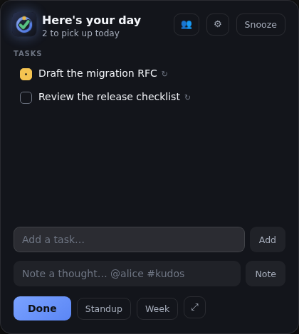

# Task Tracker

An ultra-lightweight Windows tray utility that asks, once an hour, what you're
working on — and writes the answers to a folder of plain Markdown you can hand to
an AI agent.

At **work start** it shows the day's list, seeded with whatever you didn't finish
yesterday. **Every hour** it slides in from the top-left to collect updates. At
**work end** it asks for the final update and next day's plan, then regenerates a
weekly rollup.

The point isn't the app. The point is that in December, "what did I actually ship
this year?" and "what has my report been up to?" have real answers.

## The vault

Everything lives in `Documents/TaskTracker` as one Markdown file per day:

```markdown
---
format: 2
date: 2026-08-03
work_start: 09:00
work_end: 17:00
---

# Monday, 3 August 2026

## Tasks

- [ ] Draft the migration RFC
- [/] Ship the rollback path _(added 2026-07-30)_
- [x] Review the release checklist

## Notes

- 10:15 — @alice unblocked the release single-handedly #kudos
- 14:00 — Deferred the cache work until the RFC lands #decision
```

| Marker  | Meaning                          |
| ------- | -------------------------------- |
| `- [ ]` | Upcoming — planned, not started. |
| `- [/]` | In progress.                     |
| `- [x]` | Completed.                       |

Open tasks roll over to the next day (up to a 4-day gap, so a holiday doesn't
resurrect a stale list). Completed tasks stay in the day that finished them.

A task that outlives the day it appeared picks up `_(added YYYY-MM-DD)_`. That
one suffix does two jobs: its presence marks the task as carried over, and it
means a single line tells you the whole story — the date in the suffix is when
the work started, the file's own date is when an `[x]` finished it, and the gap
between them is how long it was open. Work that starts and finishes in a day
stays unannotated, so a clean day reads clean.

Notes take `@person` and `#tag` inline. `#kudos` is the one that earns its keep:
it's what makes a year of scattered observations into a review document.

### Reading it with an agent

The app writes a `CONTEXT.md` into the vault on every launch, documenting the
schema, the status markers, the tag conventions, and how to answer common
questions. Point Claude at the folder and ask:

- "What did I get done last week?"
- "What has @alice been working on this quarter?"
- "Help me draft my year-end review from these notes."

Hand edits are preserved — sections and frontmatter keys the app doesn't own
survive its writes untouched, so you and an agent can both write to a day file.



## Upgrading an existing vault

**If you were using Task Tracker before day files recorded `format: 2`, there is
one thing to do — once.**

Nothing breaks if you skip it and nothing is lost. Old files stay readable and
the app never rewrites them with claims they can't support. But they also can't
say when anything started, and the app deliberately won't guess on their behalf:
in a `format: 2` file an unannotated task is a positive claim that it started
that day, and stamping that onto a file written before the field existed would
invent start dates nobody recorded. So legacy files stay legacy, and an agent
reading them will correctly report those start dates as unknown.

A one-shot script recovers them properly. It can do what the app can't, because
it reads the whole vault at once and derives each date from the file a task
actually first appears in — reconstruction from your own files, not a guess.

```bash
# 1. Quit the app, so nothing writes underneath you.

# 2. Dry run. Changes nothing; prints each task's derived span, then the diff.
node --experimental-strip-types scripts/backfill-provenance.ts "$HOME/Documents/TaskTracker"

# 3. Read it. Two weeks of files is small enough to actually check.

# 4. Apply. Copies the whole vault to a timestamped sibling folder first.
node --experimental-strip-types scripts/backfill-provenance.ts "$HOME/Documents/TaskTracker" --write
```

On Windows the vault is `%USERPROFILE%\Documents\TaskTracker`, or whatever
`vaultDir` points at. Running it twice is safe — the second pass reports nothing
to do.

Two things to expect in the diff:

- **Files are rewritten in the app's canonical form.** `# 2026-07-27` becomes
  `# Monday, 27 July 2026`, notes sort chronologically, and empty sections gain
  `_No notes yet._` placeholders. Nothing is lost; this is what your next
  check-in would have done to those files anyway.
- **A task title that disappears and comes back is dated as new work**, not as
  one task open the whole time. That's deliberate — otherwise a recurring
  "triage the queue" reports as open for a fortnight, which is exactly the kind
  of number that ends up in a review document.

The one thing it can't recover is a task that was already open before your
earliest day file. It's dated to the first file it can be observed in, which is
a floor rather than a fact — the same caveat `CONTEXT.md` gives the agent.

## Getting started

```bash
pnpm install          # deps + git hooks
pnpm run dev          # browser preview of the card — no Rust needed
pnpm run tauri dev    # the real desktop app (needs the Rust toolchain)
```

Settings are edited from the **gear on the check-in card** or **Settings…** in
the tray, and persist to `settings.json` in the app config directory:

| Setting              | Default       | What it does                                            |
| -------------------- | ------------- | ------------------------------------------------------- |
| `workStart`          | `09:00`       | When the day-start prompt fires.                        |
| `workEnd`            | `17:00`       | When the wrap-up prompt fires.                          |
| `vaultDir`           | (default)     | Vault folder; empty means `Documents/TaskTracker`.      |
| `hourlyEnabled`      | `true`        | Hourly nudges between start and end.                    |
| `snoozeMinutes`      | `10`          | How long Esc / Snooze defers a check-in.                |
| `workDays`           | `[1,2,3,4,5]` | Which days to prompt on, `0` = Sunday … `6` = Saturday. |
| `managerModeEnabled` | `false`       | Adds a day-end step for logging what a report is up to. |

The panel also toggles launch-at-login, which is OS state rather than a key in
that file, and shows the active vault path read-only — pointing it somewhere
else still means editing `vaultDir` by hand, because a folder picker needs a
capability the app doesn't currently ask for.

Editing the file directly still works. A corrupt or partial `settings.json` is
silently repaired to defaults so the app always starts; the panel does the
opposite and reports what's wrong, because a form that quietly reverts what you
typed teaches you nothing.

## How it interrupts you

A check-in is due when its **slot** is current and unhandled. Slots are derived
from your work window — one at work start, one on each hour, one at work end —
rather than from a repeating timer.

That distinction is the whole scheduler. Close your laptop at 11:55 and reopen it
at 15:30: a timer would owe you four prompts or none, while the current slot is
simply 15:00 and you get exactly one. Launching the app mid-afternoon is
immediately correct for the same reason.

Esc snoozes. "Done" marks the slot handled and gets out of the way until the next
hour.

Non-working days are silent. Which days those are is `workDays`, not a
weekend flag — a Tuesday-to-Saturday shift or a four-day week is just a different
list. Monday still inherits Friday's unfinished work: carry-over looks back up to
four calendar days, which spans a weekend and a long weekend.

The wording follows the same list. The last wrap-up before your longest break
reads **"Wrapping up the week"** and asks you to plan **Monday** rather than
"tomorrow" — which, on a Friday, would be a Saturday you weren't going to work.
For a Sunday-to-Thursday week that day is Thursday, and the hand-off is Sunday.

You can always check in outside the schedule from the tray, including on a day
off.

## Tray menu

- **Status line** — today's done / open / notes counts.
- **Check in now** — open the card outside the schedule.
- **Copy standup summary** — yesterday's completed work, today's open items and
  any `#blocker` notes, on the clipboard and ready to paste.
- **Copy week for an agent** — this week's completed work, still-open items and
  kudos, with a short preamble explaining the notation.
- **Team…** — open, create and update a per-report file. Also on the card.
- **Copy team week for an agent** — the same week across every tracked report.
- **Open vault folder**
- **Settings…** — the same panel as the card's gear, openable with nothing due.
- **Quit**

Both copy actions are also buttons on the check-in card, as **Standup** and
**Week**.

### Handing a week to an agent

The vault is already agent-readable — point a coding agent at the folder and
`CONTEXT.md` tells it what the markers mean. **Copy week** is for the case where
it can't see the folder: pasting into a chat. So the copied text carries its own
key — what `@name` and `#kudos` mean, that "still open" is a snapshot rather than
abandoned work, and that a missing day means nothing was logged rather than that
nothing happened. It's the one output designed to be read with no vault in front
of you.

## Verifying it works

```bash
pnpm run check    # format, lint, typecheck, unit tests
pnpm run build    # it bundles
pnpm run e2e      # it actually runs — the real card, driven in a browser
```

The end-to-end suite drives the real check-in card: adding tasks, cycling
statuses, finishing a check-in and asserting the resulting Markdown. That's
possible because the frontend is framework-free and browser-runnable, so the
browser exercises the same controller, scheduler and serializer as the desktop
build.

`pnpm run e2e -- capture` regenerates `docs/screenshots/`. Look at them — a
screenshot has already caught a wrong prompt that no assertion did.

What e2e cannot cover: the tray, window positioning, transparency,
launch-at-login, and Windows focus behavior. Those need real hardware.

## Stack

Tauri v2, vanilla TypeScript, Vite. No UI framework, on purpose — the app runs
all day, so idle memory is a feature.

Pure logic lives in `src/lib` with sibling `*.test.ts` files. `pnpm run check`
runs format, lint, typecheck and tests; `pnpm run build` proves it bundles.

## Status

Pre-v0.1. The web layer is built and tested (461 unit tests plus 82 end-to-end
tests driving the real card in a browser), and the Rust layer compiles clean —
`cargo check`, `cargo test`, `cargo clippy -D warnings` and `cargo fmt --check`
all pass.

Everything above the MVP line in [`docs/future-work.md`](docs/future-work.md) is
built: the check-in loop, the vault and its rollups, the settings panel, manager
mode, and the tray.

What has **never run** is the app itself on a Windows desktop. That is the only
thing standing between this and v0.1. See "Known unknowns" for what needs
verifying on real hardware, starting with whether the card can take keyboard
focus under Windows' foreground-activation rules — the one open question that
could force a design change.

## License

MIT — see [LICENSE](LICENSE).
